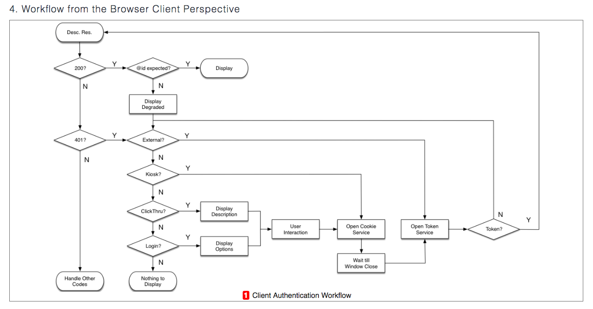
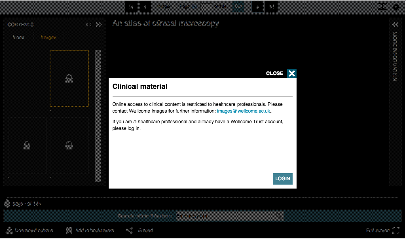
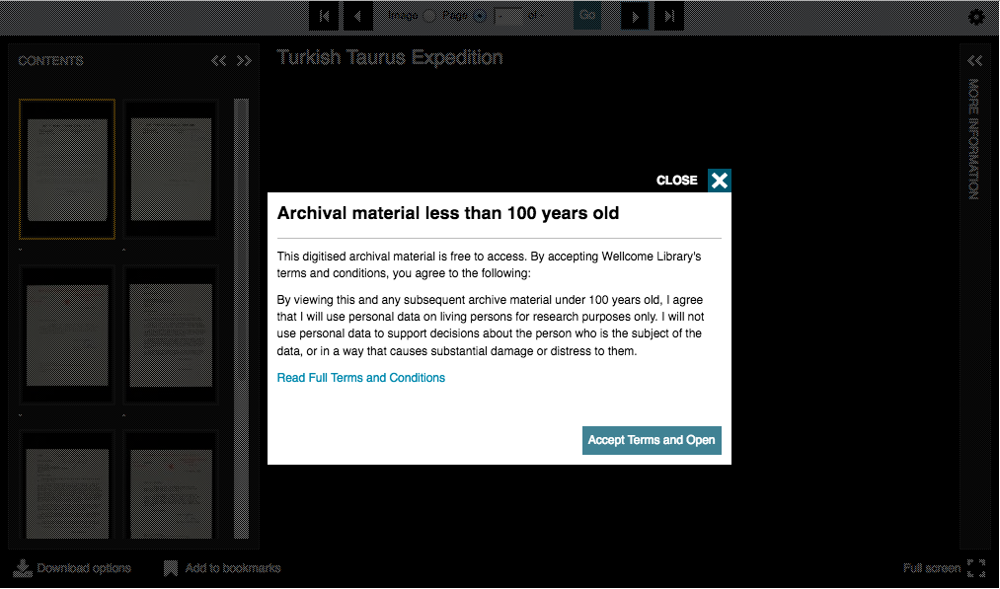

# Authentication API

<!-- #backlog:290 What else should we add to the auth section? -->

http://iiif.io/api/auth/1.0/

What if you need to restrict access to some resources? Or provide differential access based on the user? How would you continue to use the core IIIF APIs while accomplish

The Authentication API helps to orchestrate a workflow so that untrusted applications can go through required authentication steps. The untrusted IIIF client does not handle login or accepting user credentials itself, but just manages the workflow appropriately.

How you handle a logged in user differently from any other user is an implementation detail. Options include showing the user a lower resolution or degraded version of the image.

<!-- #backlog:0 could degraded access also include displaying less metadata about the resource? -->

---

The API supports the following interaction patterns:

**Login:**
The user will be required to log in using a separate window with a UI provided by an external authentication system.

---

**Click through:**
The user will be required to click a button within the client using content provided in the service description.

---

**Kiosk:**
The user will not be required to interact with an authentication system, the client is expected to use the access cookie service automatically.

---

**External:**
The user is expected to have already acquired the appropriate cookie, and the access cookie service will not be used at all.

## Questions

- Will you need to restrict access to any IIIF resources?
- Will you have to provide degraded access to any resources?
- Which of the above interaction patterns might apply to your situation?

## Demonstration

Auth Demonstrator https://iiifauth.digtest.co.uk/
