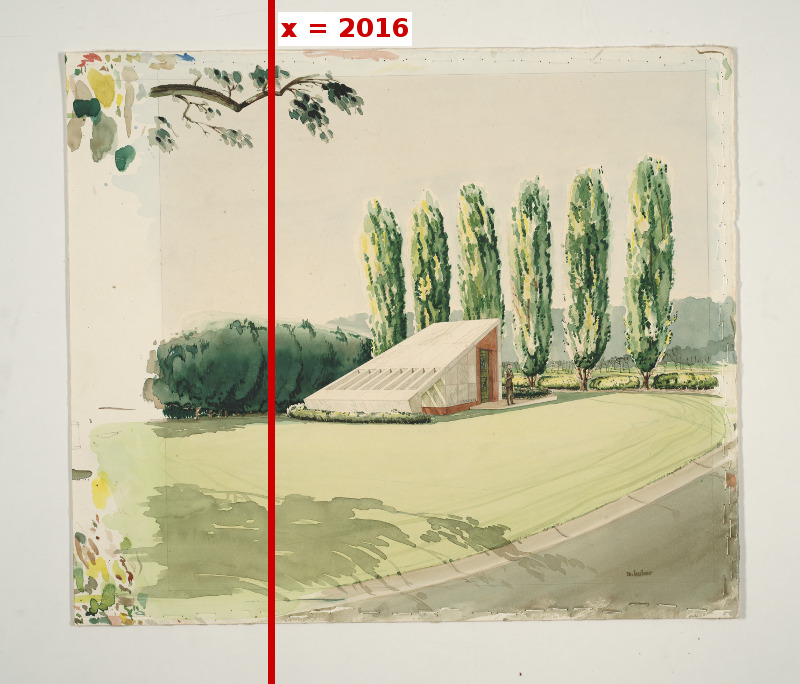
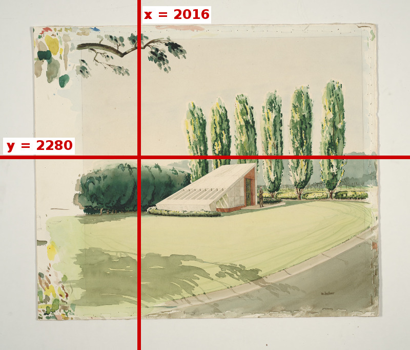
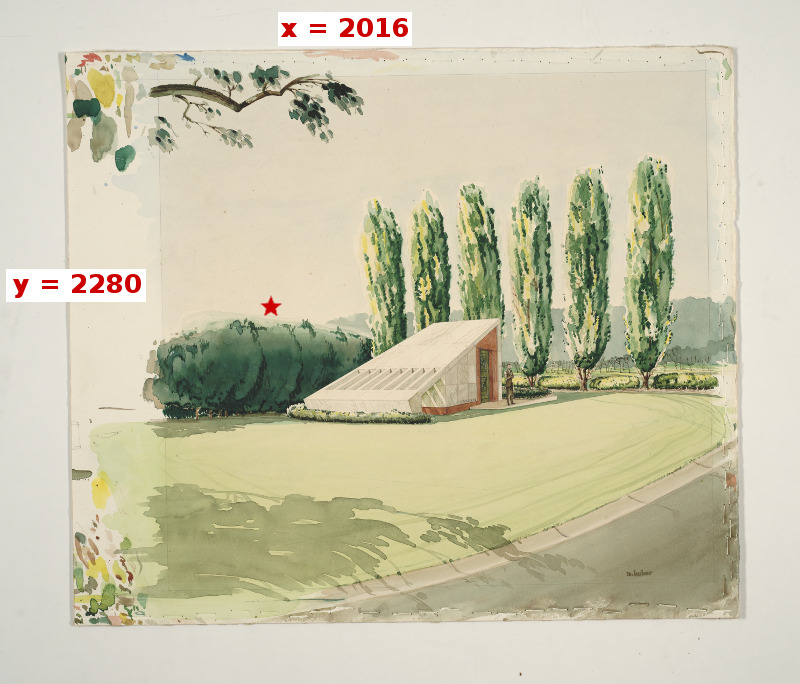
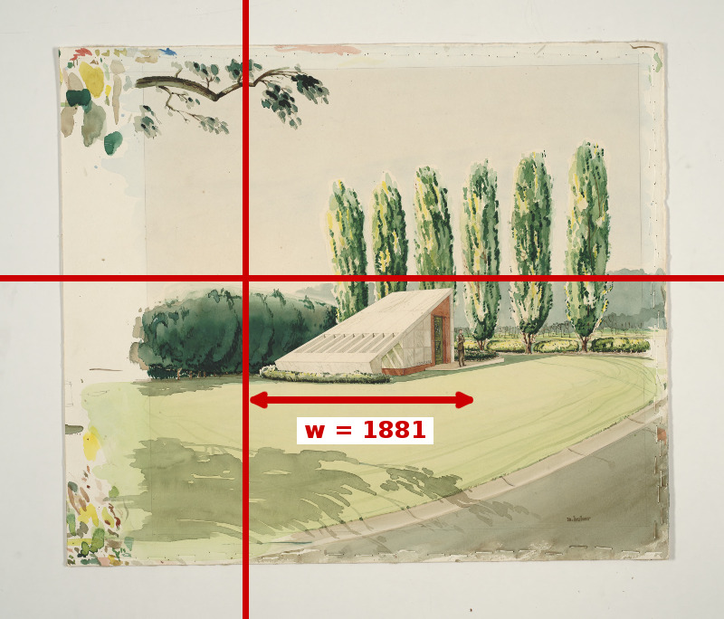
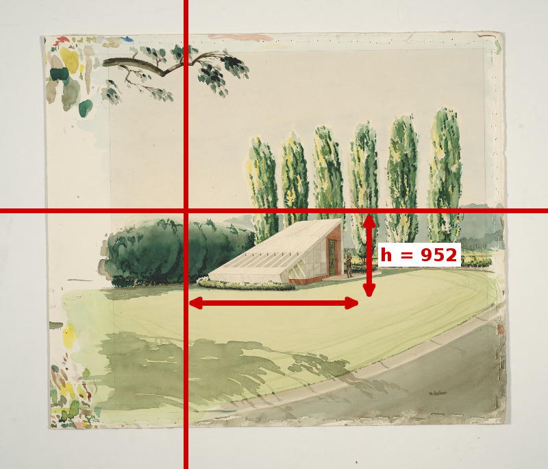
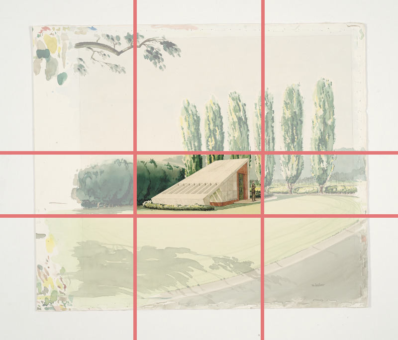

# Detailed Image API Parameters Example

<!-- #todo:0 Add a visual example of how to pull out parameters -->

Here's a visual tour of how you can extract a region and manipulate the image further.

We'll start with the full size version of this image and crop out just the building. You can see where the architect was testing out colors, so it'd be nice to crop those out.

The resource we'll use is [Perspective from the West - Front by Henry L. Kamphoefner](https://d.lib.ncsu.edu/collections/catalog/mc00198-008-ff0051-000-001_0001).

This is the URL we will end up with:

`https://iiif.lib.ncsu.edu/iiif/mc00198-008-ff0051-000-001_0001/2016,2280,1884,952/500,/0/default.jpg`

Let's walk through it.

## Image Server Base URL

Highlighted is the portion of the URL that would be the same for all of the images delivered from the same image server.

> <a href="https://iiif.lib.ncsu.edu/iiif/mc00198-008-ff0051-000-001_0001/2016,2280,1884,952/500,/0/default.jpg" target=_blank><strong>https://iiif.lib.ncsu.edu/iiif/</strong>mc00198-008-ff0051-000-001_0001/2016,2280,1884,952/500,/0/default.jpg</a>

## Identifier

The identifier is: `mc00198-008-ff0051-000-001_0001`

> <a href="https://iiif.lib.ncsu.edu/iiif/mc00198-008-ff0051-000-001_0001/2016,2280,1884,952/500,/0/default.jpg" target=_blank>https://iiif.lib.ncsu.edu/iiif/<strong>mc00198-008-ff0051-000-001_0001</strong>/2016,2280,1884,952/500,/0/default.jpg</a>

## Region

> <a href="https://iiif.lib.ncsu.edu/iiif/mc00198-008-ff0051-000-001_0001/2016,2280,1884,952/500,/0/default.jpg" target=_blank>https://iiif.lib.ncsu.edu/iiif/mc00198-008-ff0051-000-001_0001/<strong>2016,2280,1884,952</strong>/500,/0/default.jpg</a>

Our single `xywh` parameter value is `2016,2280,1884,952`. We can break out the individual parameters like this:

| parameter | value |
|:----------|:------|
| x         | 2016  |
| y         | 2280  |
| w         | 1884  |
| h         | 952   |

### Region: x

To get the `x` position we count over 2016 pixels.

### Region: y

We then go down from the top by 2280 pixels to get the `y` position.

### Region: xy Point

What we're really doing is selecting the `xy` point on the image.

### Region: w

From that xy point we measure out the width in pixels.

### Region: h

Finally from the xy point we measure out the height in pixels.

### Selected Region

Here's the region we've selected from the full image based on our `xywh` parameters.

### Full Size Image of Selected Region

  

## Size

That's still quite a large image so we can scale the image down.

> <a href="https://iiif.lib.ncsu.edu/iiif/mc00198-008-ff0051-000-001_0001/2016,2280,1884,952/500,/0/default.jpg" target=_blank>https://iiif.lib.ncsu.edu/iiif/mc00198-008-ff0051-000-001_0001/2016,2280,1884,952/<strong>500,</strong>/0/default.jpg</a>

## Rotation

Let's say we wanted to rotate the image 180 degrees. Our URL would look like this:

> <a href="https://iiif.lib.ncsu.edu/iiif/mc00198-008-ff0051-000-001_0001/2016,2280,1884,952/500,/180/default.jpg" target=_blank>https://iiif.lib.ncsu.edu/iiif/mc00198-008-ff0051-000-001_0001/2016,2280,1884,952/500,/<strong>180</strong>/default.jpg</a>

## Quality

We requested the default quality through. We could also ask for a gray version:

> <a href="https://iiif.lib.ncsu.edu/iiif/mc00198-008-ff0051-000-001_0001/2016,2280,1884,952/500,/0/gray.jpg" target=_blank>https://iiif.lib.ncsu.edu/iiif/mc00198-008-ff0051-000-001_0001/2016,2280,1884,952/500,/0/<strong>gray</strong>.jpg</a>

## Format

We request a JPEG image:

> <a href="https://iiif.lib.ncsu.edu/iiif/mc00198-008-ff0051-000-001_0001/2016,2280,1884,952/500,/180/default.jpg" target=_blank>https://iiif.lib.ncsu.edu/iiif/mc00198-008-ff0051-000-001_0001/2016,2280,1884,952/500,/180/default.<strong>jpg</strong></a>
