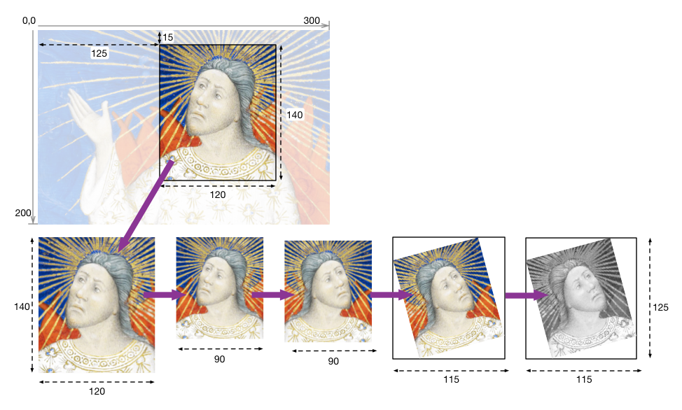

# Order of Implementation

http://iiif.io/api/image/2.1/#order-of-implementation

1. Region is extracted from the full size image
2. The image is scaled with the size
3. The image is mirrored before it is rotated (even though these are part of the same parameter in the URL)
4. The image is rotated
5. The quality is set to grayscale
6. The format is selected

## Canonical URI Syntax

http://iiif.io/api/image/2.1/#canonical-uri-syntax
