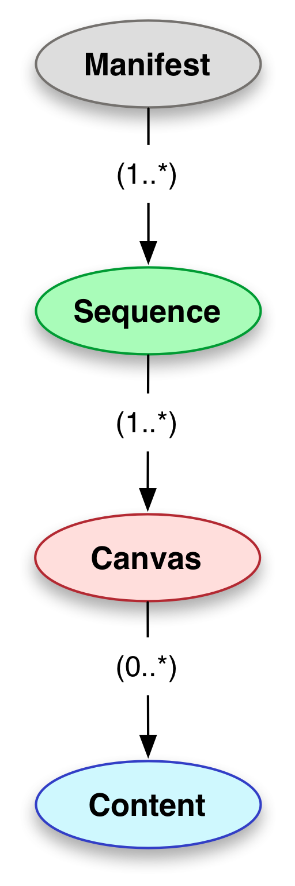

# Presentation API

The Presentation API provides enough information to drive a viewing experience.

This workshop will cover version 2.1.1 of the Presentation API.

http://iiif.io/api/presentation/2.1/

We'll answer these questions:
- What is a manifest?
- What is a canvas?
- How do images and the Image API relate to the Presentation API?

<!-- - #todo:100 what other learning objectives should we have for Presentation? -->

## Basic Types

http://iiif.io/api/presentation/2.1/#basic-types

