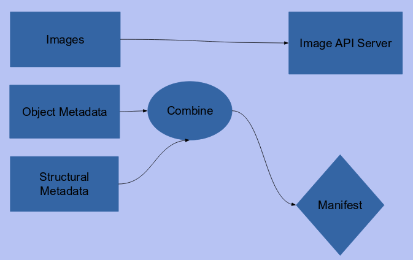
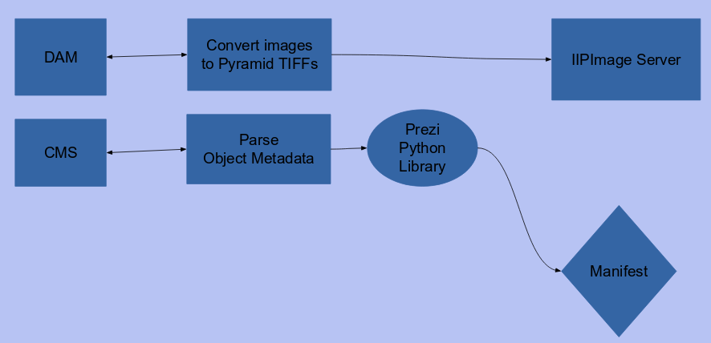
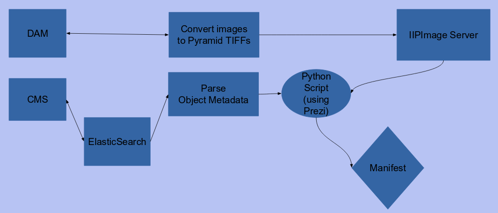

# Presentation Data Workflows

Each institution is likely to have different steps towards implementing IIIF and make different decisions on priorities for implementation.

While the community is interested in developing various cookbooks, for now most institutions need to blaze their own path. There are some good stories emerging though for how different institutions have succeeded that might help.
<!-- #backlog:0 Are there any cookbooks that exist now? -->

## Questions

Before looking at some of the examples, take a moment to ask yourself these questions.

- What identifier(s) do you have that are shared across systems?
- Where do you store descriptive metadata?
- Do you currently store technical information like the width and hight of images?
- How can you export data from these systems? Do you have adequate APIs into your systems?
- Will you be able to dynamically query for data via APIs or will you need to export data dumps?

<!-- #backlog:30 Maybe this is already covered: Show how different types of data that might be coming from different systems get mapped into IIIF. Talk about how to approach that mapping and automating output of manifests. -->

## Iterative Examples

### Bavarian State Library

The Bavarian State Library presented on the steps they took to a production IIIF workflow: [IIIF (at scale) at the Bavarian State Library][bavarian].

### Victoria &amp; Albert Museum

This is a graphical example from the V&A.

Here's the abstract approach that was required:

Here's a start:

As they go along it gets more complicated and full of features:

[bavarian]: https://drive.google.com/open?id=0B8biwZuDijgednFYVlREWVc2Y0E
