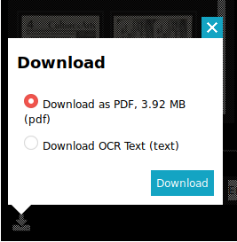

# Linking Properties

http://iiif.io/api/presentation/2.1/#linking-properties

The IIIF Presentation API recognizes that your resources are complicated, compound objects that are a part of other objects. A Resource can be associated with related resources on the web. Resources are often available in other formats. IIIF allows for expressing these linkages through the following linking properties.

> Note: In version 2 of the specification these properties seem underspecified. Use of these properties have [varied across institutions](https://github.com/benwbrum/fromthepage/wiki/IIIF-Linking-Properties-Usage-Survey). As linking properties have gotten more attention and use, this will likely be rectified in a future version of the specification.

Linking properties can be applied to any resource type. (Take a look at the [Summary of Metadata Requirements][summary-metadata] and scroll down to "Linking Properties".)

Different clients will handle these properties differently and may not use every property when applied to every resource. They can allow for downloading a resource or following a link to an external resource.

## Example

Here's an example of part of a manifest with the various linking properties we'll discuss below.

```json
{
  "@context": "http://iiif.io/api/presentation/2/context.json",
  "@id": "http://example.org/iiif/book1/manifest",
  "related": {
    "@id": "http://example.org/videos/video-book1.mpg",
    "format": "video/mpeg"
  },
  "rendering": {
    "@id": "http://example.org/iiif/book1.pdf",
    "label": "Download as PDF",
    "format": "application/pdf"
  },
  "seeAlso": {
      "@id": "http://example.org/library/catalog/book1.marc",
      "format": "application/marc",
      "profile": "http://example.org/profiles/marc21"
    },
  "service": {
    "@context": "http://iiif.io/api/annex/services/physdim/1/context.json",
    "profile": "http://iiif.io/api/annex/services/physdim",
    "physicalScale": 0.0025,
    "physicalUnits": "in"
  }
  ...
}
```

## `related`

> A link to an external resource intended to be displayed directly to the user, and is related to the resource that has the related property. Examples might include a video or academic paper about the resource, a website, an HTML description, and so forth.

## `rendering`

> A link to an external resource intended for display or download by a human user....Other uses include a rendering of a manifest as a PDF or EPUB with the images and text of the book, or a slide deck with images of the museum object.

## `seeAlso`

> A link to a machine readable document that semantically describes the resource with the seeAlso property, such as an XML or RDF description.

Common ways that this is used is for linking to descriptive metadata in various formats and to OCR text. Work is currently in development through the [Discovery Technical Specification Group][discovery-group] to better indicate how different communities could link to their metadata formats.

The best [documentation on linking to OCR][linking-ocr] has been created by the [Newspapers Community Group][newspapers-group].

<!-- #backlog:400 link to the Europeana schema.org study when that is published -->

## `service`

> A link to a service that makes more functionality available for the resource, such as from an image to the base URI of an associated IIIF Image API service.

We've already seen how the `service` property can be used to [add an Image API service to an image resource](image-service.md).

We'll see later how the `service` property can be used to [add a Content Search API service](../search/service-in-manifest.md) to a manifest.

It can also be used to [link to non-IIIF services](http://iiif.io/api/annex/services/) like [GeoJSON] and [physical dimensions].

Services can be a powerful extension mechanism for adding interesting and fun new abilities to resources.

## User Interface Examples

What options do you get in a viewer and how might you use those resources?

### Nubian Message

Visit this [issue of the Nubian Message][nubian-message]. At the bottom right of the Universal Viewer is a download icon. Click on it and you'll get the option to download a PDF of the resource or the OCR extracted from the page images.



### Portrait gallery of pugilists of America and their contemporaries

Visit this [book of boxers]. Click on the download link.

[summary-metadata]: http://iiif.io/api/presentation/2.1/#b-summary-of-metadata-requirements
[GeoJSON]: http://iiif.io/api/annex/services/#geojson
[physical dimensions]: http://iiif.io/api/annex/services/#physical-dimensions
[nubian-message]: https://d.lib.ncsu.edu/collections/catalog/nubian-message-2003-04-01
[book of boxers]: https://digital.library.villanova.edu/Item/vudl:92879

[linking-ocr]: https://docs.google.com/document/d/1rz-Dm_LMguPD_Zi6Z1uf61XaPrdhd3mgK9_SV3EBdlE/edit#heading=h.gn82mp9sesw9
[discovery-group]: http://iiif.io/community/groups/discovery/
[newspapers-group]: http://iiif.io/community/groups/newspapers/

<!-- #next:210 show more live examples of manifests that use these linking properties with examples of how they display in a client and what functionality the properties enable -->
