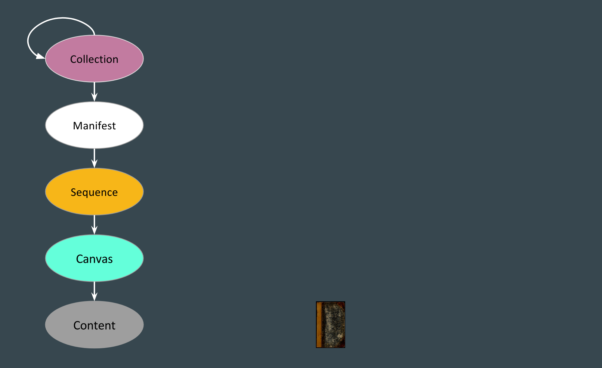
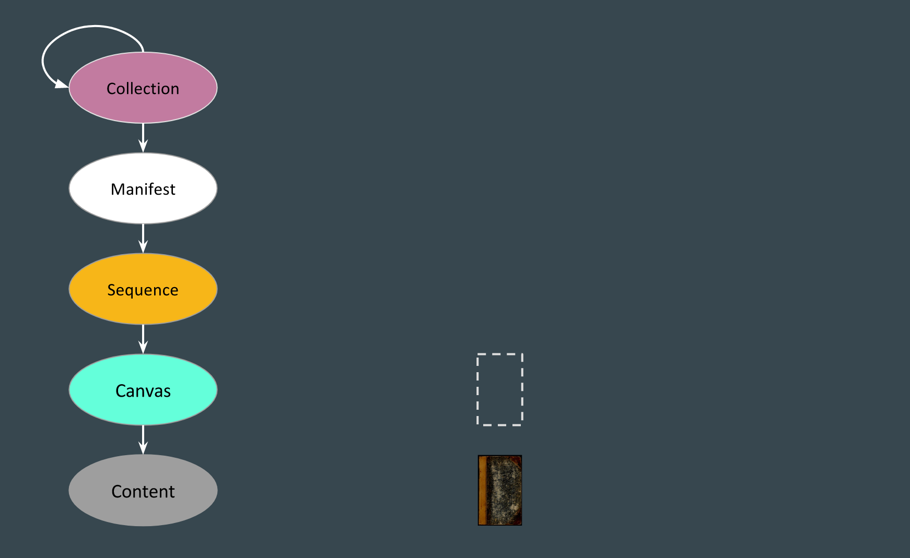
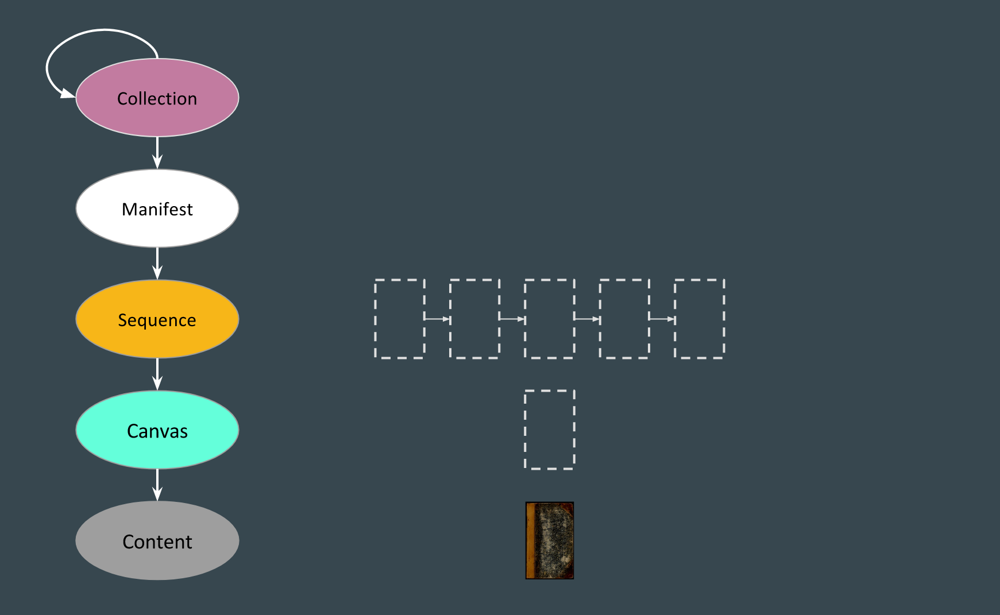
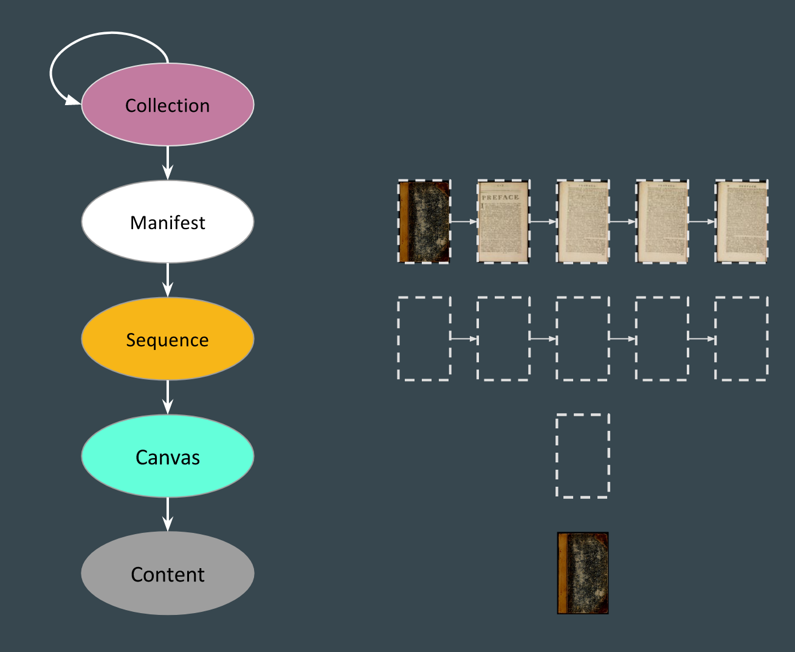
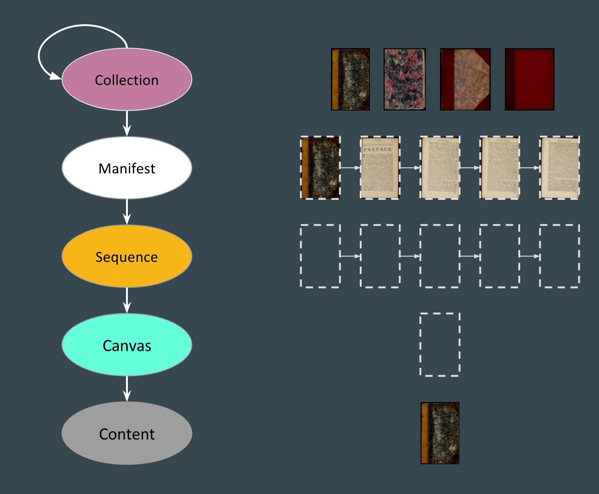
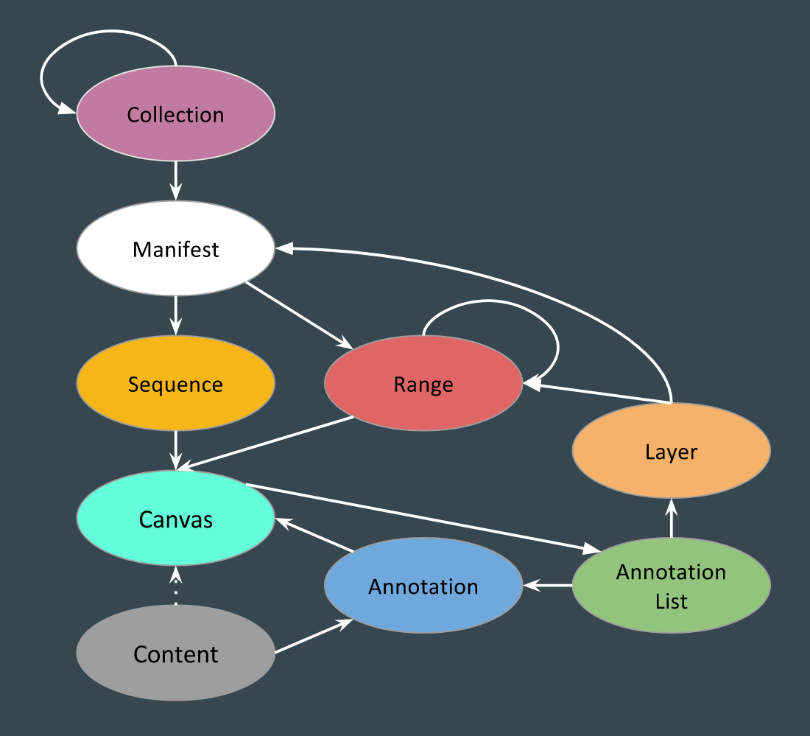

# Manifest Structure

To explain a manifest we'll start at the innermost part of the manifest and work our way out.

## Content

The content we have is an image. In our case we'll also have an image server service for that image. Just having an image though doesn't allow for things like a scholar to apply annotations to the image.

## Canvas

The next layer up and out we have our [shared canvas](shared-canvas.md) that can have our image content painted onto it.

## Sequence

Many resources are made of more than one image, so a sequence is used to group and order canvases.

## Manifest

The manifest contains the information needed to display (e.i. present) the resource to users. The manifest wraps up the sequence(s) that encapsulate the canvases that have the image content painted on. The manifest includes other properties, but it is the sequences property that encapsulates the image content.

## Collection

Another level up it is possible 

## Fuller Picture

