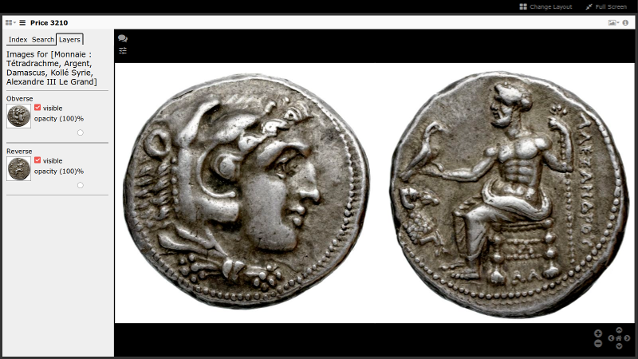

# Multiple Images Exercise

We'll now do an exercise we're going to take an existing manifest and modify it to add two images next to each other on the same canvas.

Here's our beginning manifest:

```json
!INCLUDE "../manifests/coin-before.json"
```

1. [Copy the above manifest](../manifests/coin-before.json) into a file named "coin.json" and place it next to your "manifest.json" file in the ["iiif-workshop" directory](../preparation/directory.md) you're using for your [web server](../preparation/web-server.md).

2. Drag this coin onto Mirador below. (You may need to do this twice.)

  [][this-coin]



This manifest already has two images on the single canvas. When you view it in Mirador only one shows up. The last image annotated onto the canvas covers over the the first image.

To see the other side of the coin open up the layers panel in Mirador and turn off the visibility of the second image.

Here's a video of what this ought to look like:

<video src="../assets/video/coin-before.mp4" preload="auto" controls></video>

## Modifying the Manifest

We now want these to show up side-by-side on the same canvas. As you make changes you may need to clear your cache, reload the page, and drag the coin.json manifest back into Mirador.

You'll need to do two things:

1. Change the dimensions of the canvas so that it can hold two images that are each 2610 pixels wide by 2610 pixels high.

  > What's the width of the canvas needed to hold both images side-by-side?

2. Annotate each image onto a region of the canvas.

  > Change the `on` property to include information for where on the canvas the image ought to be placed. See the previous page in these materials for more information on how to do this.

  > Consider taking a piece of paper to sketch out the layout and do the math. Note that counting pixels starts a zero.

---

## Answer

1. The width of the final canvas should be 5220 pixels wide.
2. The first image should be off to the left and the second image to the right using these values at the end of the `on` parameter for each image.
  - first image: `#xywh=0,0,2610,2610`
  - second image: `#xywh=2610,0,2610,2610`

[Get the final manifest here](../manifests/coin-after.json). Copy it as "coin.json" and load it into Mirador again.

In the end ought to see something like the following:



> This example is taken from a manifest and question Ethan Gruber of the American Numismatic Society had in the IIIF Slack.

[this-coin]: http://localhost:3000/coin?manifest=http%3A%2F%2Flocalhost%3A3000%2Fcoin.json
