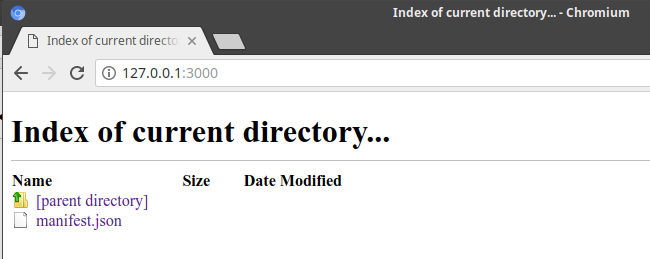

# Setup

Let's get set up to create a manifest. Below each step we'll give directions on how to do this from the terminal on a Mac. Feel free though to do each step however you'd like.

**Create a directory/folder named "iiif-workshop"**

Doesn't matter where as long as you'll be able to find it.

On a Mac in the terminal you can type:

```sh
mkdir iiif-workshop
```

**Change into the "iiif-workshop" directory**

On a Mac:

```
cd iiif-workshop
```

**Create an empty text file named "manifest.json" in the "iiif-workshop directory"**

If you're using a Mac in the terminal you can type:

```shell
touch manifest.json
```

**Open your text editor**

If you're using Atom you can type:

```
atom .
```
**Open your empty manifest file**

In your editor you can navigate to open up "manifest.json".

You ought to see your completely empty manifest file in your editor.

**Start up a local web server pointing to the "iiif-workshop" directory**

See the included instructions on how to set up a [simple web server](preparation/web-server.md).

**Open the directory in your browser**

If you used Web Server for Chrome according to the instructions, you can visit http://localhost:3000 or http://127.0.0.1:3000. From now on we'll use "localhost" in every case, but if that doesn't work, substitute "127.0.0.1".

You should see something like this in your browser:



**Add content to your "manifest.json"**

We'll just add some empty JSON for now:

```json
{
  "property": "value"
}
```

**Open up your manifest in browser**

Click on "manifest.json" in the directory listing in your browser or visit http://localhost:3000/manifest.json.
