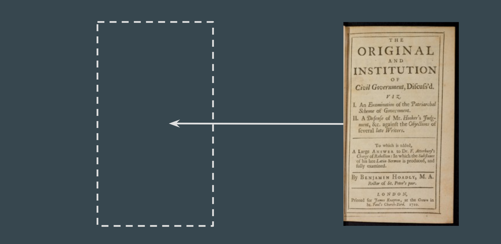
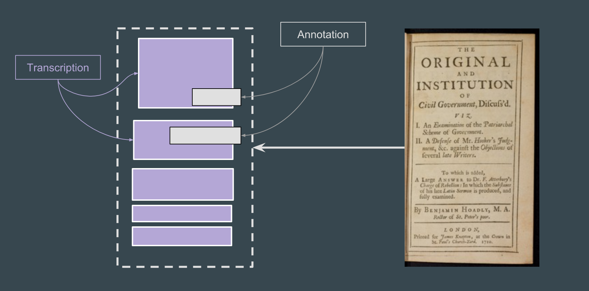

# Shared Canvas

<!-- #todo:0 harmonize with language from presentation/canvas.md -->

http://iiif.io/model/shared-canvas/1.0/

A canvas is a coordinate space on which images can be painted. Images are painted onto a canvas through annotation. In the simple case we're only painting a single image annotation so that it fills the whole canvas.

We call it a shared canvas because it allows for painting multiple images onto the same canvas as well as overlaying additional annotations.

Think of a canvas as an empty presentation slide. You can put a page image on the canvas via annotation:

Once you have a base image painted onto the canvas you can then apply further annotations like transcriptions, translations, scholarly commentary.

> While just one related piece of how IIIF works, the shared canvas model is vital for understanding what IIIF enables and how.
