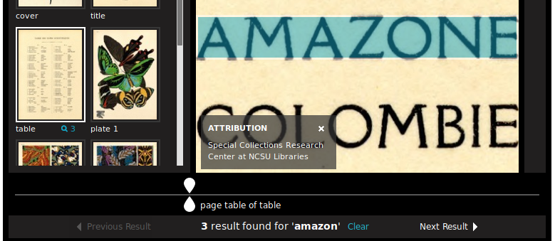

# Adding a Content Search Service to a Manifest

<!-- #doing:0 add section on adding a search service to a manifest. add instructions on how to add content search to our manifest -->

We're going to add a search service to our manifest now.

> We only have one canvas which has much of any text and that's the only page we'll be able to search when we're done. That's just a limitation of our example and not the search API.

## Prepare the Canvas

Before can search we'll need to adjust our canvas to point to

- Search for the canvas with the label of "table"
- Change the `@id` for that canvas to https://d.lib.ncsu.edu/collections/canvas/segPap_003

> Remember the search service results match up with the `@id` of the canvas. This is how a client will know which page the result belongs to and where to paint the result.

## Services

<!-- #todo:0 write more about services -->

We've seen already how it is possible to [add an image service](../presentation/image-service.md) for an image. We can add other services that add functionality as well.

http://iiif.io/api/presentation/2.1/#service

You can read more about services here:
http://iiif.io/api/annex/services/

## Content Service

We simply add a content search service

Add a `service` property at the same level as the top-level `metadata` and `description` properties. The value of `service` should be a list/array.

> Don't copy/paste the "..."

```json
{
  ...
  "service": [
    {
      "@context": "http://iiif.io/api/search/0/context.json",
      "@id": "https://ocr.lib.ncsu.edu/search/segPap_003",
      "profile": "http://iiif.io/api/search/0/search",
      "label": "Search within this thing"
    }
  ]
  ...
}
```

Once you've added this you ought to be able to search:

- Reload [Universal Viewer](../presentation/universal-viewer.md) or clear the cache
- Enter "amazon" into the search box
- Press Enter



## Autocomplete Service

In order to add an autocomplete service we embed another service within our search service. We can say that our content search service also includes an autocomplete service.

Now make your search service look like this:

```json
{
  ...
  "service": [
    {
      "@context": "http://iiif.io/api/search/0/context.json",
      "@id": "https://ocr.lib.ncsu.edu/search/segPap_003",
      "profile": "http://iiif.io/api/search/0/search",
      "label": "Search within this thing",
      "service": {
        "@id": "https://ocr.lib.ncsu.edu/suggest/segPap_003",
        "profile": "http://iiif.io/api/search/0/autocomplete",
        "label": "Get suggested words"
      }
    }
  ]
  ...
}
```

Now if you refresh [Universal Viewer](../presentation/universal-viewer.md) and do a search you should begin to see suggestions show up above the search box.


